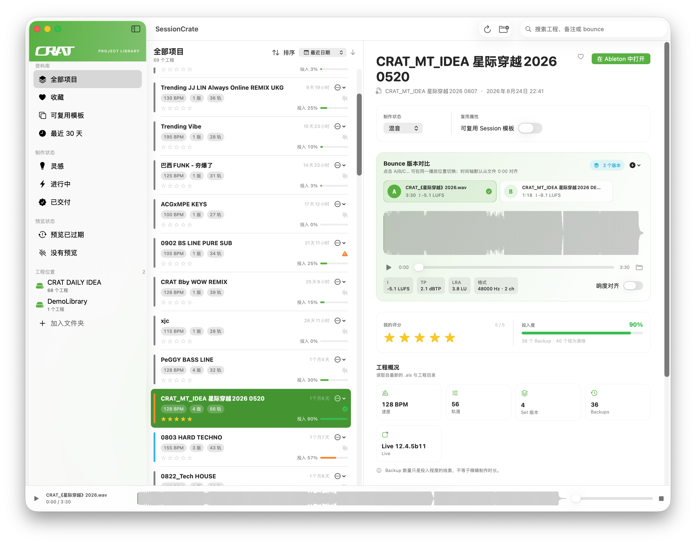
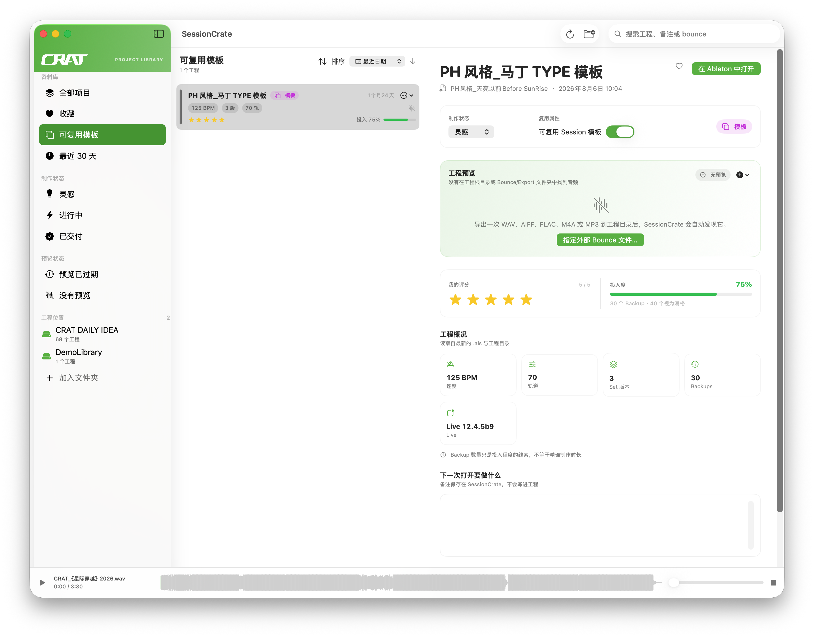

# CRAT SessionCrate

### 把散落的 Ableton Live 工程，整理成可以直接试听的音乐资料库。

SessionCrate 是一款原生 macOS 应用。把工程文件夹加入资料库，就能浏览工程、查看版本和制作状态、收藏灵感、保留可复用模板，也能直接试听导出的 Bounce，在同一播放位置切换版本并对齐响度。找到想继续的作品后，一键在 Ableton Live 中打开。

**[下载 v0.2.0 Alpha](https://github.com/crat86/crat-session-crate/releases/tag/v0.2.0-alpha)** · **[反馈问题](https://github.com/crat86/crat-session-crate/issues)**  
Apple Silicon · macOS 13.0+ · 本地资料库 · 无需账号

*工程列表、制作状态、Bounce 版本比较、响度读数、评分与工程概况，在同一个窗口里查看。*

## 工程多了，也能知道每首做到哪一步

| 功能 | 具体能做什么 |
| --- | --- |
| 多个工程位置 | 同时加入多个文件夹，支持本机与外置硬盘；记住授权的位置，按资料库来源筛选工程。 |
| 自动发现与版本归组 | 扫描 `.als`，按 Ableton Project 归组 Set 版本，查看最新修改时间与版本列表，统计 Backup 数量。 |
| 工程概况 | 直接读取最新 Set 的 BPM、轨道数量、Live 版本，以及工程的 Set 版本数与备份数。 |
| 搜索与排序 | 搜索工程名称、备注、Bounce 文件名等信息；按最近日期、投入度、BPM、星级或工程名称排序，并切换升降序。 |
| 收藏与最近工程 | 收藏想继续的作品，快速筛选最近 30 天修改的工程。 |
| 制作状态 | 标记灵感、进行中、编曲、混音、已交付或归档；侧栏快速查看灵感、进行中和已交付项目。 |
| 五星评分与投入度 | 给工程打分；用 Backup 数量显示投入程度，帮助回顾值得继续的工程。投入度只是参考线索，不等于精确制作时长。 |
| 下次要做什么 | 为每个工程保存备注，记录待修改的段落或下次打开要做的事情；备注保存在 SessionCrate，不写入原工程。 |

## 把能继续用的工程，留在模板库里

模板属性与制作状态分开管理：一个工程可以处于“灵感”或“混音”阶段，同时被标记为可复用 Session 模板。通过侧栏进入模板库，快速找回常用的轨道配置、音色起点或风格工程。

*独立的模板标记、五星评分、投入度、工程元数据与备注，帮助积累自己的制作起点。*

## 不必打开 DAW，也能听到工程的样子

| 功能 | 具体能做什么 |
| --- | --- |
| 自动匹配 Bounce | 从工程根目录及 Bounce、Export 等导出位置查找音频，支持 WAV、AIFF、FLAC、M4A、MP3 和 CAF。 |
| 多个预览版本 | 同一个工程可以匹配多个 Bounce；同名的无损与有损导出优先保留无损版本，并排除明显的 Stem / 分轨文件。 |
| 外部音频关联 | 手动为工程指定一个或多个外部 Bounce，记住文件授权；音频保持在原来的位置，不复制进资料库。 |
| 预览状态提醒 | 区分没有预览、较旧 Bounce、最新 Bounce 与多个版本；可单独筛选缺少预览或预览已过期的工程。 |
| 真实波形试听 | 从实际音频生成 PCM 峰值波形；点击或拖到指定位置开始播放，支持播放、暂停、停止、进度拖动与音量调整。 |
| A/B/C… 版本切换 | 切换 Bounce 时保持相同的绝对播放时间，方便反复比较同一段落。 |
| 响度与格式读数 | 在本地分析完整音频，显示 Integrated LUFS、True Peak（dBTP）、Loudness Range（LU）、采样率和声道数；基于 EBU R128 的响度分析结果在本次运行中缓存。 |
| 响度对齐 | 可选地把较响的版本衰减到候选中最安静版本的 Integrated LUFS，减少音量差对比较的影响；不会放大较安静的版本。 |
| 全局播放器与菜单栏 | 底部播放器持续控制当前预览；菜单栏也能播放、暂停、点击波形定位，并快速回到最近工程。 |

## 找到以后，直接继续做

- **一键打开 Ableton Live**：打开选中的 Set，回到制作现场。
- **在 Finder 中定位**：显示工程目录、Set 或当前 Bounce，继续整理文件。
- **工程整理**：通过列表菜单将不需要的工程移到 macOS 废纸篓，操作前会要求确认。
- **缓存与刷新**：再次启动先显示缓存的工程索引，随后后台刷新；支持目录变化监听和手动刷新。
- **本地工作**：无需账号，无网络依赖。工程扫描和元数据读取不修改 `.als` 文件。

## 下载与开始使用

1. 打开 **[Release 下载页](https://github.com/crat86/crat-session-crate/releases/tag/v0.2.0-alpha)**，下载 `SessionCrate.alpha.zip`。
2. 解压，将 `SessionCrate.app` 拖入“应用程序”。
3. 打开应用，加入存放 Ableton Live 工程的文件夹。
4. 为需要试听的工程导出音频到工程目录，或在应用内指定已有的外部 Bounce。

**当前版本：v0.2.0 Alpha。** 支持 Apple Silicon Mac，要求 macOS 13.0 或更新版本；当前安装包不支持 Intel Mac。此 Alpha 构建尚未经过 Apple 公证，首次打开可能被 macOS 安全检查拦截。

比较时，音频默认从各自文件的 0:00 对齐；若某个导出多了一段前置静音，当前不会自动估算或补偿时间偏移。SessionCrate 试听的是已有导出音频，不会替 Ableton Live 渲染工程。

---

Copyright © 2026 CRAT. All rights reserved.  
第三方组件声明与许可随应用包提供。

